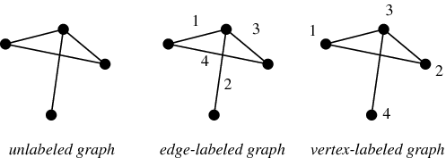
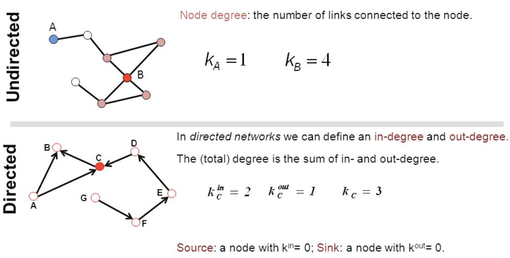
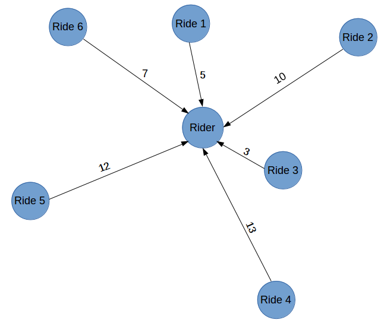
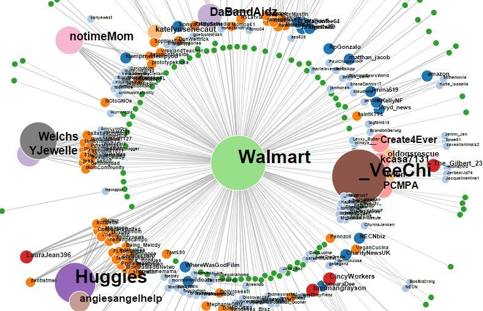
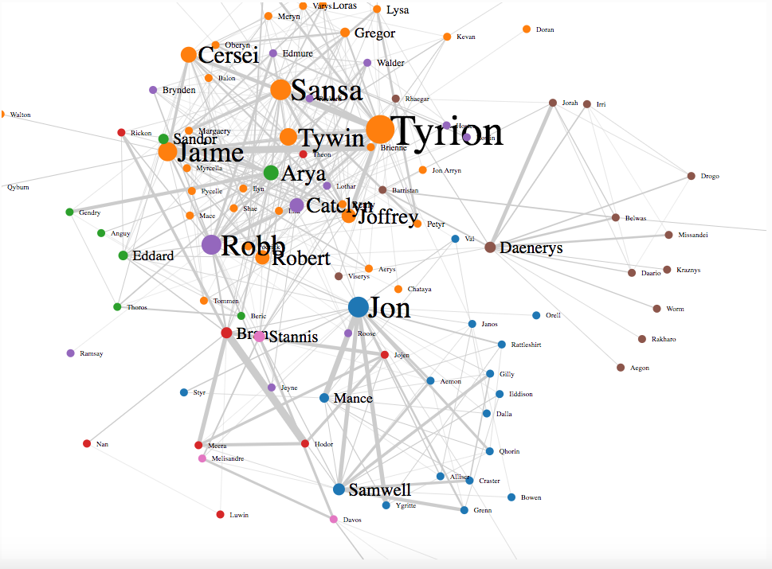
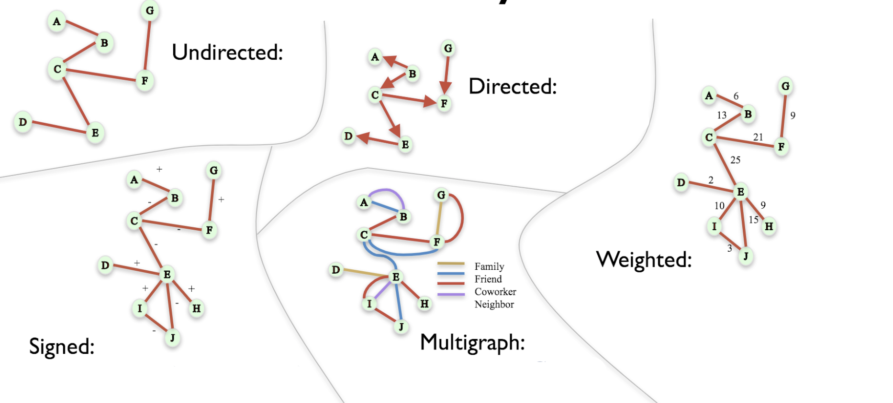

# Introduction to Graph Theory 

## Introduction

Graph theory is the study of mathematical structures used to model pairwise relations between objects, otherwise known as graphs. Such a structure is made up of vertices, nodes, or points which are connected by edges, arcs, or lines. Network theory is a part of graph theory: a network can be defined as a graph in which nodes and/or edges have attributes (e.g. names). In this lesson we shall have a quick look at what this theory encompasses, what a graph looks like and also look at some real examples. 

## Objectives
* Understand and explain fundamental concepts and terminology used in graph theory
* Describe a graph with its constituent components including nodes and edges
* Understand different types of networks with respect to their formations

### So what is a graph 

A graph is one of the most common mathematical abstractions of data. Even if you have never encountered this mathematical concept before, you have most likely seen graphs in routine observations. A project plan, a circuit,  dependencies between code blocks in a software project are all examples of graphs. In this section we shall focus at the aspects of graph processing that play a role in network analysis (or social network analysis).
```
 Liza------likes------>Bob
(noun)     (verb)     (noun)
```
Above example shows the most basic network called a dyad. Every dyad denotes a single relationship (an edge) *likes*. The nouns in the phrase represent people involved in the relationship (known as a node). 

Right, so let's quickly see some basic definitions ..

>A "**Graph**" in mathematical and computer science terms consists of "**Nodes**" or "**Vertices**". Nodes/Vertices may or may not be connected with one another. The connecting line between two nodes is called an "**edge**". This is shown in the example below:

In social network analysis, nodes have a type. Each node may show a person, a company, a website, a tweet, etc. If a      graph contains nodes of only one type, it’s called a **1-mode graph**. If it contains relationships between      two types, it’s **bimodal** or 2-mode. We can also have **multimodal graphs**.

### Parts of a Graph


__Node / Vertex__: The entity of analysis which has a relationship. Node is used in the network context, vertex is used in the graph theory context, but both terms are often used interchangeably.

__Link / Edge / Relationship__: The connections between the nodes. Link is used in the network context, edge is used in the graph theory context, and all words are used interchangably with *relationship*.

__Attributes__: Both nodes and edges can store attributes, which contain additional data about that object.

__Weight__: A common *attribute* of edges, used to indicate *strength* or *value* of a relationship.


### Graph Characteristics

Graphs are typically classified based on the presence of weights and direction attached to the edges in a graph. The table below covers what we call each type of graph:

|                | Absent     | Present  |
|----------------|------------|----------|
| __Weights__ | Unweighted | Weighted |
| __Directionality__ | Undirected | Directed |


Nodes in a graph are usually labeled to help identify them.  If the edges between the nodes are undirected, the graph is called an **Undirected Graph**. If an edge is directed from one vertex (node) to another, a graph is called a **Directed Graph**. An directed edge is called an **Arc**, as is represented with a arrow head.


Weighted graphs may be shown with a weight value explicitly written, or visually it may be sown as strengths of the edges. 


In some cases, weights may be associated with nodes themselves instead of edges , these options are shown below:


Here are some more terms that you will come across in graph analysis

### Adjacent node
A node 'v' is said to be adjacent node of node 'u' if and only if there exists an edge between 'u' and 'v'.

### Degree of a node
* In an undirected graph the number of nodes incident on a node is the **degree** of the node.
* In case of directed graph, **Indegree** of the node is the number of arriving edges to a node, whereas, **Outdegree** of the node is the number of departing edges to a node.


### Isolated node:
A node with degree 0 is known as isolated node.Isolated node can be found by Breadth first search(BFS). It finds its application in LAN network in finding whether a system is connected or not.

### Path: 
A path of length 'n' from node 'u' to node 'v' is defined as sequence of n+1 nodes.

$$P(u,v)=(v0,v1,v2,v3…….vn)$$

A path is simple if all the nodes are distinct,exception is source and destination are same.


### This is good , But why do I need to know about this ?

Graph is a data structure which is used extensively in our real-life.

* **Social Networks**: Each user is represented as a node and all their activities,suggestion and friend list are represented as an edge between the nodes.
* **Google Maps**: Various locations are represented as vertices or nodes and the roads are represented as edges and graph theory is used to find shortest path between two nodes.
* **Recommendations on e-commerce websites**: The “Recommendations for you” section on various e-commerce websites uses graph theory to recommend items of similar type to user’s choice.
* Graph theory is also used to study molecules in chemistry and physics.


Think of an example of booking an Uber taxi using Uber's intelligent system relation drivers to clients. Think of Uber connecting a client to number of possible drivers , which can be shown as the graph below:




So the 6 possible rides (Ride 1 … Ride 6) are shown in this in graph, connected rider to the rides. The links between rider and rides are shown to reflect the distance between them. This makes it easier to visualize and match the closest ride to the user. We can clearly visualize that Ride 3 is the closest option.

Remember, here we are using a single metric (distance) for our decision. In a real life scenario, there are multiple metrics through which the allotment of a ride is decided, such as rating of the rider and driver, traffic between different routes, time for which the rider is idle, etc.


One the key benefits of using graphs in the data science domain is that its a great visualization and analysis technique. Graphs are incredibly useful in helping businesses make data-driven decisions.

Graphs allow us to visualize and process data in more detail, while using visual cues and other elements highlighting the relationships between different objects . For example, in the Twitter network graph below, (built using Python NetworkX, which we shall see shortly). This graph is based on the use of mention @Walmart.  We can see a strong tweet connection with Huggies. Network graphs like the one above can be used to study interactions in social media which may lead to insights that can be useful in the real world. 



Let's have a look at another graph below. The points in the visual represent the characters of Game of Thrones, while the lines joining these points represent the connection between them. Jon Snow has connections with multiple characters, and the same goes for Tyrion, Cersei, Jamie, etc.



## Additional Resources
* [Graph Theory Basics](https://www.geeksforgeeks.org/mathematics-graph-theory-basics-set-1/)
* [A Gentle Introduction to Graph Theory](https://medium.com/basecs/a-gentle-introduction-to-graph-theory-77969829ead8)

## Summary 


In this lesson, we looked at basics of graph theory and what comprises a graph. We looked at how nodes and edges can form different formations within a graph. We also looked at some example of real world graphs. NExt we shall start digging a bit deeper into this topics and start building our graphs using the popular python library called `NetworkX`.
